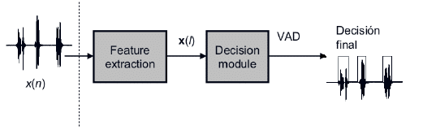

## Voice Detector

<p align="center">
  
  
</p>

Thing's need to change before run the command below
1. You got annotation .csv files for each audio 
2. Audio files in any format that can be processed by `librosa` library.
3. Audio file names must match with annotation .csv files.

Before run train and inference, setup vertiual env.
```
mkdir VD-KazakhSpeech
python3 -m venv .venv 
```
For Linux (Ubuntu):
```
source .venv/bin/activate
```
For Window: 
```
.\.venv\Scripts\activate
```
Review requirements.txt and then install it:
```
pip install -r requirements.txt
```
To run `train.py`. Before running: review the config.yml files
```
python train.py -p ./configs/NAME_OF_YOUR_CONFIG_FILE.yml
```
Warining: Be careful where you run the script

To run `inference.py`
```
python inference.py PATH_TO_SAMPLE -plot -s -t THRESHOLD -c checkpoints/NAME_OF_YOUR_CONFIG_FILE -w weights/WEIGHT_FILE_NAME
```
Warning: run the file `inference.py` with the trained model weights and the config file. 

Scheme of data folder:
```
data/
    annotation/ 
        Csv/
            Dev/
            Test/
            Train/
        Json/
            Dev/
            Test/
            Train/
    KSC2/
        Dev/
        Test/
        Train/
    samples/
        5ed8a1c0f3ea2.flac
        5ed8a1c0f3ea2.csv
```